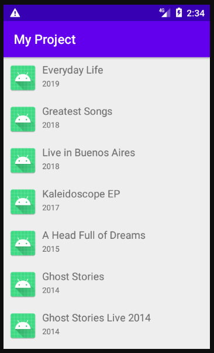
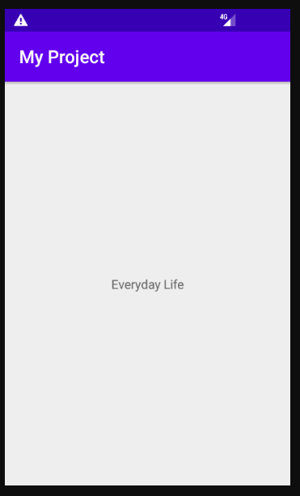
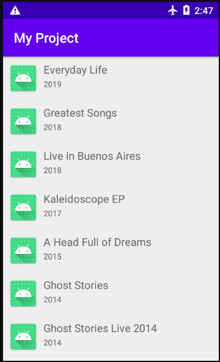
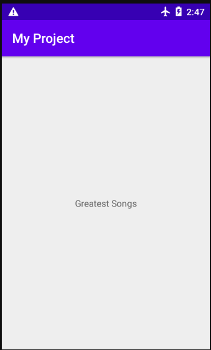

# My_Project, Application Android 
* Auteure: Céline Lam
* Pseudo GitHub: kohashi20
* Classe: 3A section internationale

## Présentation
Il s'agit d'une application qui affiche une liste de musique, précisément des albums de Coldplay. Pour se faire, j'ai utilisé l'API TheAudioDB.
Les données sont stockées même lorsque le mode avion est activé. Un écran "détail" s'affiche si l'on clique sur un élément de la liste.
L'application est codée en Java.

## Prérequis
* Installation d'Android Studio

## Consignes respectées
* Ecran avec une liste d’éléments.
* Ecran avec le détail d’un élément.
* Appel WebService à une API Rest.
* Stockage de données en cache
* Architecture :
  * Singleton
  * Design Patterns
  * MVC
  * Principes ( SOLID, KISS, DRY )
* Gitflow (essayé)

## Fonctionnalités
* Premier écran, dès le lancement de l'application

* Second écran, quand on clique sur "Everyday Life"

* Premier écran en mode avion

* Second écran, quand on clique sur "Greatest Songs" en mode avion

